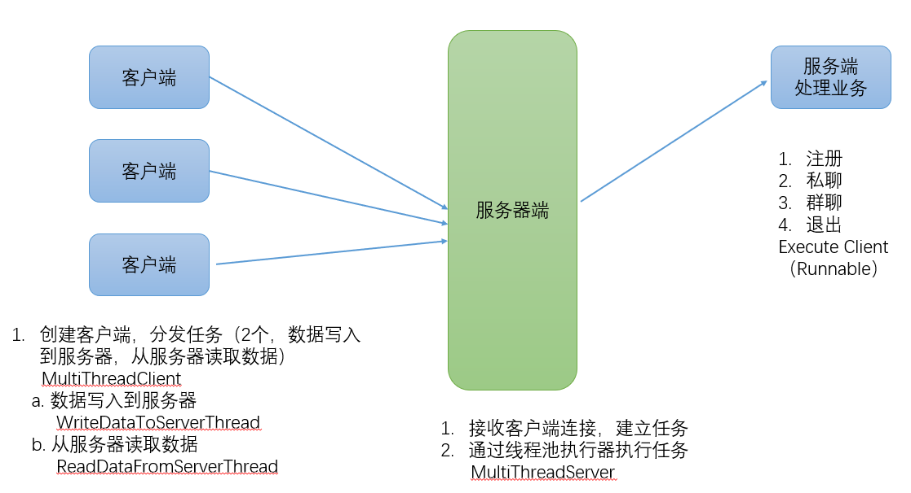

## 项目名称
网络聊天室

## 项目描述
支持群聊、单聊的网络聊天室。

## 使用技术
+ java 基础
+ Socket 编程
+ 多线程

## 项目功能
+ 注册
+ 私聊
+ 群聊
+ 退出

## 项目实现

+ 服务端：采用线程池调度执行服务器与客户端的业务处理逻辑
+ 客户端：采用读写线程，分别处理交互与服务器数据接收

## 项目总结
+ 掌握了Java的网络的常用的API和步骤
+ 掌握了多线程的使用和业务处理
+ 熟练使用maven工具

## 优化与扩展
+ 优化
    + 参数严格校验
    + 异常信息处理
    + 用户体验
+ 扩展
    + 数据存储到存储引擎
    + 注册信息存储
    + 增加登录功能
    + 历史消息存储